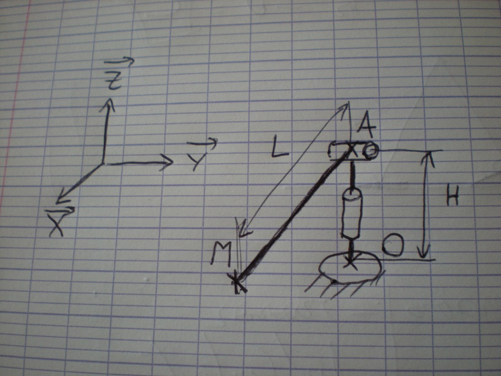
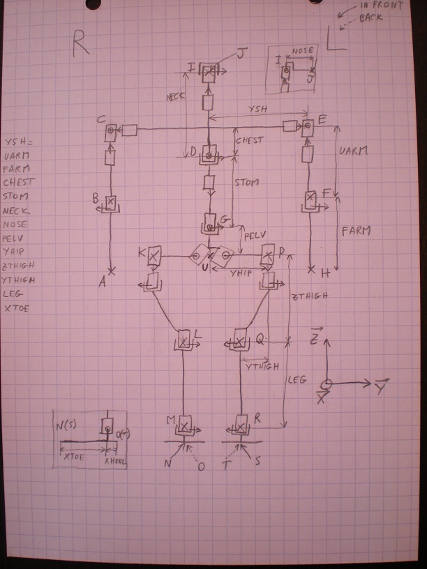

# Benchmarking of direct kinematic computation
## Benchmarking on a small pan-tilt robot
To make Poppy walk, we need to compute the coordinates of at least the articulations of the legs and their sensitivity to motor move for optimisation purpose.

Before operating on the big robot, the idea is to compute for a small model of pan-tilt turret which sketch is :

The function which does it is in the script pantilt.py.
The performances are very linked to the use of numpy and the use of matrix computation acceleration like BLAS or ATLAS. To see the configuration of your numpy, type:

```
import numpy
numpy.show_config()
```

If the computer is optimized for matrix computation, the clue is to use as far as possible matrix multiplication with numpy. Here, the Jacobian computation is done with numpy.cross function. But this fonction only use multiplication in python. If the cross function is done via matrix multiplication, it can go 3 times faster!
Here are the result for a classical ODROID U3 (the one used for Poppy)
```
end effector
[ 0.09999924  0.00017453  0.04965093]
computation time in micros
179.43406105
computation time in micros without Jacobian
115.551948547
computation time in micros without BLAS
292.736053467
BLAS gain
2.77361060831
```
For a intel core i5 with Pythonxy the results are :
```
end effector
[ 0.09999924  0.00017453  0.04965093]
computation time in micros
46.9999313354
computation time in micros without Jacobian
15.0001049042
computation time in micros without BLAS
77.999830246
BLAS gain
1.96875209549
```
## Benchmarking on Poppy Robot
The same experiment has been done on Poppy robot using the script MGD_poppy.py.
Here are the computation times in microseconds:

| Computer      | Full robot | Full robot + Jacobian | legs  | legs + Jacobian |
| ------------- | ---------- | --------------------- |------ | --------------- |
| ODROID U3     | 976us      | 3723us                | 504us | 1386us          |
| Intel i5      | 234us      | 922us                 | 109us | 328us           |

The sketch used to compute the Poppy model has been simplified to have most of the points in the same plane (only nose and toes are outside the plane)

